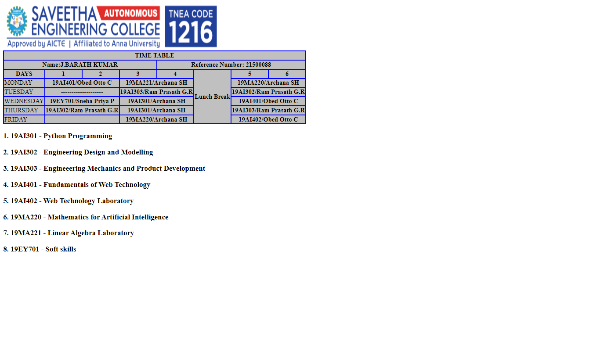

# Experiment_Time_Table

## AIM
To Write a html webpage page to display your timetable.

# ALGORITHM
### STEP 1
create a simple table using table tag
### STEP 2
Add header row using th tag
### STEP 3
Add your timetable
### STEP 4
Execute the program

# CODE
~~~<!DOCTYPE html>
<html>
 <head>
 <title>TIME TABLE</title>
 </head>
 <body>

<table border = "1" cellspacing="1" bordercolor="blue" bgcolor="silver">

 <tr>
 <th colspan="8">TIME TABLE</th>
 </tr>
 <tr>
<th colspan="4">Name:J.BARATH KUMAR</th>
<th colspan="4">Reference Number: 21500088</th>
</tr>
 <tr>
 <th>DAYS</th>
 <th>1</th>
 <th>2</th>
 <th>3</th>
 <th>4</th>
 <th rowspan="6">Lunch Break</th>
 <th>5</th>
 <th>6</th>
 </tr>
 
 <tr>
 <td>MONDAY</td>
 <th colspan="2">19AI401/Obed Otto C</th>
 <th colspan="2">19MA221/Archana SH</th>
 <th colspan ="2">19MA220/Archana SH</th>
 </tr>
<tr>
 <td>TUESDAY</td>
  <th colspan="2">--------------------</th>
 <th colspan="2">19AI303/Ram Prasath G.R</th>
 <th colspan ="2">19AI302/Ram Prasath G.R</th>
 </tr>
 <tr>
 <td>WEDNESDAY</td>
 <th colspan="2">19EY701/Sneha Priya P</th>
 <th colspan="2">19AI301/Archana SH</th>
 <th colspan="2">19AI401/Obed Otto C</th> 
 </tr>
 <tr>
<td>THURSDAY</td>
<th colspan="2">19AI302/Ram Prasath G.R</th>
<th colspan="2">19AI301/Archana SH</th>
<th colspan ="2">19AI303/Ram Prasath G.R</th>
 </tr>
 <tr>
 <td>FRIDAY</td>
 <th colspan="2">-------------------</th>
 <th colspan="2">19MA220/Archana SH</th>
 <th colspan ="2">19AI402/Obed Otto C</th>
 
 </tr>
 </table>
<H3><align = "center">1. 19AI301 - Python Programming</align></H3>
<H3><align = "center">2. 19AI302 - Engineering Design and Modelling</align></H3>
<H3><align = "center">3. 19AI303 - Engineeering Mechanics and Product Development</align></H3>
<H3><align = "center">4. 19AI401 - Fundamentals of Web Technology</align></H3>
<H3><align = "center">5. 19AI402 - Web Technology Laboratory</align></H3>
<H3><align = "center">6. 19MA220 - Mathematics for Artificial Intelligence</align></H3>
<H3><align = "center">7. 19MA221 - Linear Algebra Laboratory</align></H3>
<H3><align = "center">8. 19EY701 - Soft skills</align></H3>

 
 </body>
</html>
~~~
# OUTPUT

